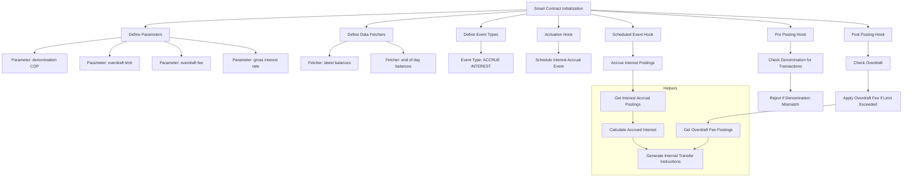

```mermaid
graph TD
    A[Smart Contract Initialization] --> B[Define Parameters]
    A --> C[Define Data Fetchers]
    A --> D[Define Event Types]

    B --> P1[Parameter: denomination COP]
    B --> P2[Parameter: overdraft limit]
    B --> P3[Parameter: overdraft fee]
    B --> P4[Parameter: gross interest rate]

    C --> F1[Fetcher: latest balances]
    C --> F2[Fetcher: end of day balances]

    D --> E1[Event Type: ACCRUE INTEREST]

    A --> E[Activation Hook]
    E --> E2[Schedule Interest Accrual Event]

    A --> G[Scheduled Event Hook]
    G --> G1[Accrue Interest Postings]
    G1 --> J2[Get Interest Accrual Postings]
    J2 --> J3[Calculate Accrued Interest]
    J3 --> J4[Generate Internal Transfer Instructions]

    A --> H[Pre Posting Hook]
    H --> H1[Check Denomination for Transactions]
    H1 --> H2[Reject if Denomination Mismatch]

    A --> I[Post Posting Hook]
    I --> I1[Check Overdraft]
    I1 --> I2[Apply Overdraft Fee if Limit Exceeded]
    I2 --> J1[Get Overdraft Fee Postings]
    J1 --> J4

    subgraph Helpers
        J1[Get Overdraft Fee Postings]
        J2[Get Interest Accrual Postings]
        J3[Calculate Accrued Interest]
        J4[Generate Internal Transfer Instructions]
    end
```