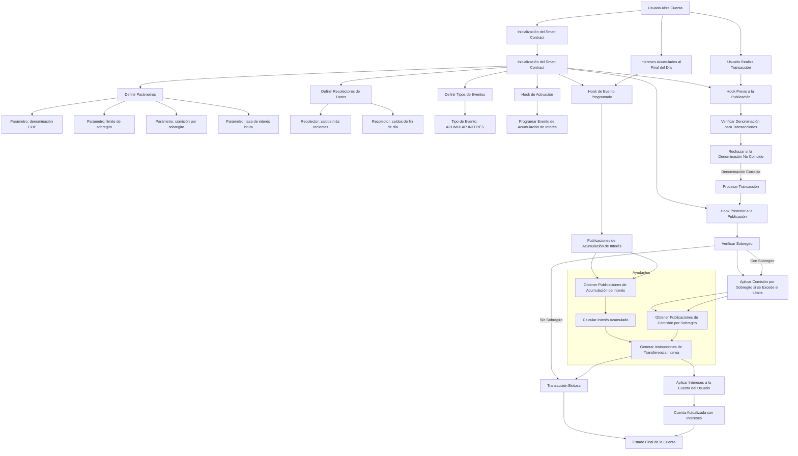

```mermaid
graph TD
    A[Inicialización del Smart Contract] --> B[Definir Parámetros]
    A --> C[Definir Recolectores de Datos]
    A --> D[Definir Tipos de Eventos]

    B --> P1[Parámetro: denominación COP]
    B --> P2[Parámetro: límite de sobregiro]
    B --> P3[Parámetro: comisión por sobregiro]
    B --> P4[Parámetro: tasa de interés bruta]

    C --> F1[Recolector: saldos más recientes]
    C --> F2[Recolector: saldos de fin de día]

    D --> E1[Tipo de Evento: ACUMULAR INTERÉS]

    A --> E[Hook de Activación]
    E --> E2[Programar Evento de Acumulación de Interés]

    A --> G[Hook de Evento Programado]
    G --> G1[Publicaciones de Acumulación de Interés]
    G1 --> J2[Obtener Publicaciones de Acumulación de Interés]
    J2 --> J3[Calcular Interés Acumulado]
    J3 --> J4[Generar Instrucciones de Transferencia Interna]

    A --> H[Hook Previo a la Publicación]
    H --> H1[Verificar Denominación para Transacciones]
    H1 --> H2[Rechazar si la Denominación No Coincide]

    A --> I[Hook Posterior a la Publicación]
    I --> I1[Verificar Sobregiro]
    I1 --> I2[Aplicar Comisión por Sobregiro si se Excede el Límite]
    I2 --> J1[Obtener Publicaciones de Comisión por Sobregiro]
    J1 --> J4

    subgraph Ayudantes
        J1[Obtener Publicaciones de Comisión por Sobregiro]
        J2[Obtener Publicaciones de Acumulación de Interés]
        J3[Calcular Interés Acumulado]
        J4[Generar Instrucciones de Transferencia Interna]
    end

    %% Expansión del flujo E2E desde el punto de vista de Negocio
    Z1[Usuario Abre Cuenta] --> Z2[Inicialización del Smart Contract]
    Z2 --> A
    Z1 --> Z3[Usuario Realiza Transacción]
    Z3 --> H
    H2 --> |Denominación Correcta| Z4[Procesar Transacción]
    Z4 --> I
    I1 --> |Sin Sobregiro| Z5[Transacción Exitosa]
    I1 --> |Con Sobregiro| I2
    I2 --> J1
    J4 --> Z5

    Z1 --> Z6[Intereses Acumulados al Final del Día]
    Z6 --> G
    G1 --> J2
    J4 --> Z7[Aplicar Intereses a la Cuenta del Usuario]
    Z7 --> Z8[Cuenta Actualizada con Intereses]
    Z5 --> Z9[Estado Final de la Cuenta]
    Z8 --> Z9
```